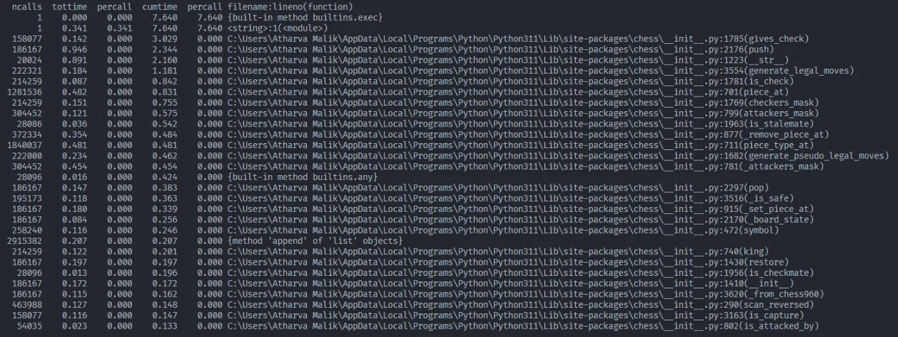
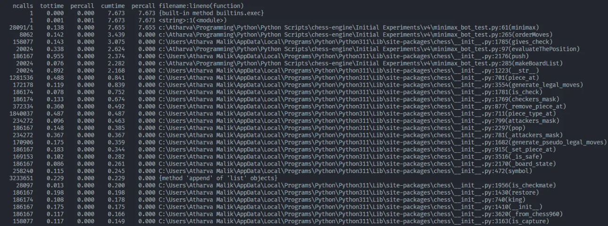
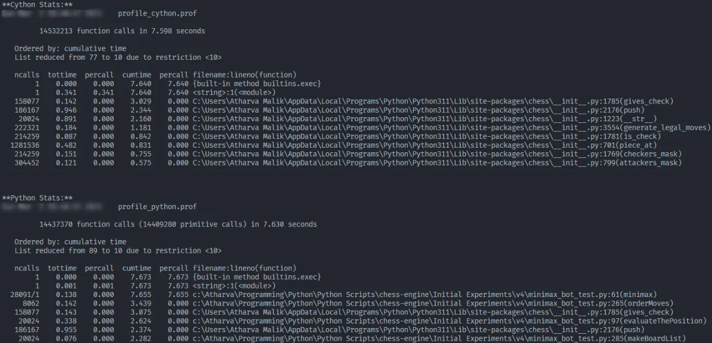
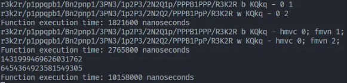
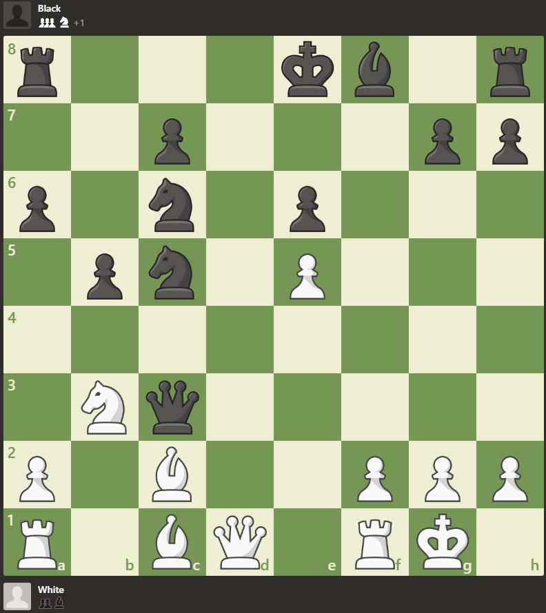
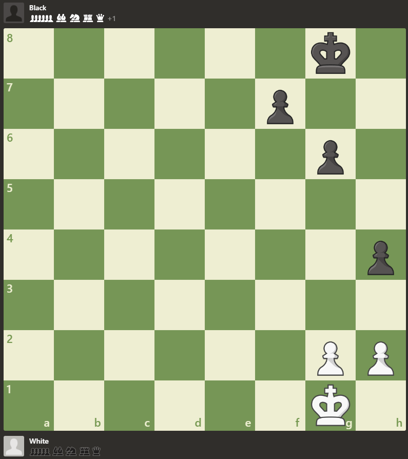

# Sprint Logs
The following logs are for the sprints of the project. Each sprint is documented with its version number, time spent, and a summary of the work done.

## Sprint 0 - Research and Planning
I spent multiple days researching and learning about the technologies and tools that would be used in this project. This included understanding the basics of chess engine functionality and understanding reinforcement learning concepts. 
### Reinforcement Learning Resources
- [Reinforcement Learning from Scratch](https://www.youtube.com/watch?v=vXtfdGphr3c)
- [Creating a Chess AI with TensorFlow](https://www.youtube.com/watch?v=ffzvhe97J4Q)
- [Why AI Chess Bots Are Virtually Unbeatable (ft. GothamChess) | WIRED](https://www.youtube.com/watch?v=CdFLEfRr3Qk)
### MiniMax and Chess Engines Resources
- [The Fascinating Programming of a Chess Engine](https://www.youtube.com/watch?v=w4FFX_otR-4)
- [Coding Adventure: building a strong Chess AI | Can it beat me?](https://www.youtube.com/watch?v=OWEcs-zzbho)
- [Coding Adventure: Chess](https://www.youtube.com/watch?v=U4ogK0MIzqk)
- [Coding Adventure: Making a Better Chess Bot](https://www.youtube.com/watch?v=_vqlIPDR2TU)
- [I created an AI to Play Chess](https://www.youtube.com/watch?v=DZfv0YgLJ2Q)
- [Opening Book](https://www.chessprogramming.org/Opening_Book)
- [A Comparative Study of Game Tree Searching Methods](https://www.researchgate.net/publication/262672371_A_Comparative_Study_of_Game_Tree_Searching_Methods)
- [30 Weird Chess Algorithms: Elo World](https://www.youtube.com/watch?v=DpXy041BIlA)
### Ideas Explored and Implemented
- [x] Board Implementation
- [x]  Opening Tablebase
    - [x]  Format the opening book into JSON so that you can write more elegant code
- [x]  Evaluation
    - [x]  NNUE (read the stockfish code)
    - [x]  Incremental Updates (to make code more efficient)
        - Instead of recalculating the entire evaluation from scratch for each position, maintain incremental evaluation values.
        - This would mean having a evaluation variable that you update rather than recalculating. This means custom move and unmakemove functions that work on top of the originals
        - When a move is made, only update the parts of the evaluation that have changed.
        - LAST STAGE EVALUATION
    - [x]  Piece Values
    - [x]  Piece Square Tables
        - [x]  Separate for middle and endgame (king, pawns)
    - [x]  Quiescence search
    - [ ]  King safety?
    - [ ]  Pawn structure?
    - [ ]  Mopup valuations?
        - Simply, if the game is in endgame, push the opponent king towards the edge of the board, and your king towards the opponent.
    - [x]  Passed pawns (bitboards? protected past pawns?)
        - [ ]  Isolated pawns as well
    - [ ]  Null move pruning
    - [x]  [Coding Adventure: Chess](https://www.youtube.com/watch?v=U4ogK0MIzqk?t=939) Move ordering; attacked square pruning
- [x]  MiniMax
    - [ ]  Search Extension? (i.e. looking deeper when the opponent is in check? Either pawn on the verge of promotion? Mb other ideas?)
    - [x]  Multi-threading
- [x]  Alpha-Beta pruning
    - [x]  Arrange better moves first?
- [x]  Variable Depth
    - [ ]  Middle game: 10
    - [ ]  End game: 20
    - [x]  Iterative Deepening
- [ ]  Hexaly??? ([Hexaly Optimizer](https://www.hexaly.com/hexaly-optimizer))

## Sprint 1 - v1 - 1 Day

__Goal:__
1. Implement a basic MiniMax algorithm
- This was just a start to see if I can actually use minimax, because last time I tried to implement the algorithm, it did not work at all
- First I implemented openings, using a book created by Sebastian Lague
- I also started writing code following the OOP principles to make it easier to use and export
    - I also wrote code to convert the book into a json file for easier use
- Wrote the minimax alpha-beta pruning algorithm and added an extremely basic evaluation function
    - It just adds the piece values together to give an approximate value of the position
- Worked on it until it was making moves
    - The moves seem random and it is recklessly taking pieces? Maybe there is something wrong with the eval?
- Huge update, transitioning over to v2 and v3
    - The bot’s bug was due to the fact that it was making the best moves for the other colour, thus sacrificing material

## Sprint 2 - v2 - 4 Days
__Goal:__
1. Improve speed with move ordering
- Added move ordering to significantly increase speed.
- In this (pictured below) position, it takes around 390 seconds to make a move without move ordering. With move ordering this is cut down to around 55-65 seconds. This is a 600% improvement (considering the worst time) or a 710% improvement (considering the best time).


## Sprint 3 - v3 - 1 Day
__Goal:__
1. Improve evaluation
- Added [piece-square tables](https://www.chessprogramming.org/Piece-Square_Tables) to improve its understanding of where the pieces should be placed
- Ran some games against this bot ([Garbo Chess](https://www.mathsisfun.com/games/chess.html)) and it was able to win against the beginner and intermediate levels, but it was still not very good.:
    - Won against Beginner
    - Won against Intermediate
    - Lost against Advanced
- I also noticed that it was running really slowly.

## Sprint 4 - v4 - 3 Days
__Goal:__
1. Improve speed

- Started off by trying to set the priority of the engine process to high.
    - Resulted in a non-noticeable improvement
- After this disheartening discovery I decided to try and compile the code using Cython.
- The chess engine doesn’t improve, even after compiling it. In fact it seems to be taking 2-4 more seconds per move
    - After profiling I found that the bottleneck is not the compiled code but the chess library.
    - As can be seen, the top 30 functions that are taking up the time in cython are all from the inbuilt chess library, with almost no time being taken up by the recursive minimax function
    
    - Whereas in python, the limiting factor is my code
    
    - Comparing the top 10 calls
    
- So that leaves me with 3 options, and I chose option 3 cause I wanted to make the best possible engine:
    1. I make the ordermoves function aggressively stronger, which should result in more pruning and hopefully faster times. __Low impact.__
    2.  I continue with python, making the system more and more efficient, while trying out multiprocessing (won’t work as well because at average it is analysing around $31^5$ at a depth of just 5 [[source](https://chess.stackexchange.com/questions/23135/what-is-the-average-number-of-legal-moves-per-turn) second answer] moves and that many processes will kill any computer). __Low impact due to the limitation mentioned above.__
    3. Rewrite the entire chess library in Cython. This will have a __huge impact__ as I can make the library efficient and fast.

## Sprint 5 - v5 - 13 Days
__Goal:__
1. Re-write the whole thing using C++

### v5.1 - 5 Days

Re-write the library

- I started manual testing using FENs in the main file to test for FEN functionality.
- I continued working and got my code to generated rook, queen, and bishop moves. I used switch statements where possible because [switch statements are faster than if statements in C++](https://www.youtube.com/watch?v=fjUG_y5ZaL4).
    
- I soon gave up on writing a chess library from scratch due to knight and pawn movement and how slow it already was:
    - 100,000-200,000 nps compared to 200,000,000 nps* of the new library

        *advertised
        
- New plan: use the library below:
    - https://github.com/Disservin/chess-library

### v5.2 - 8 Days

Using an existing library

- I started using the chess library and ran some benchmarks (PERFT) against the old python library.
    - First Test (starting position):
        | Library | Depth | Time (seconds) | Nodes Searched | Nodes per Second (approx) |
        | --- | --- | --- | --- | --- |
        | python-chess | 5 | 30.879215955734253  | 4,865,609 | 157,569 |
        | chess-library | __6__ | 28.7222588  | 119,060,324 | 4,145,223 |
    - Second Test (starting position):
        | Library | Depth | Time (seconds) | Nodes Searched | Nodes per Second (approx) |
        | --- | --- | --- | --- | --- |
        | python-chess | 7 | 17484.683883190155 | 3,195,901,860 | 182,783 |
        | chess-library | 7 | 751.4311222 | 3,195,901,860 | 4,253,087 |
        
        Therefore, we can conclude that chess-library is 23.2685 times faster.
        
- This sprint I just got back to the old functionality of the chess engine, but now in C++, therefore significantly faster.

## Sprint 6 - v6 - 5 Days
__Goals:__
- Making the evaluation function more efficient and increasing it's speed in general.

### v6.1 - 4 Days
So the results below use v5.2 vs v6.1 search for a complex middle game position (displayed below)


#### Approach number 1: Multiplying boolean values in the evaluation function

| Version | Time 1 (ns) | Time 2 (ns) | Time 3 (ns) | Average (ns/s) |
| --- | --- | --- | --- | --- |
| v5.2 | 7000 | 8600 | 8100 | 7900/0.0000079 |
| v6.1.1 | 6700 | 8000 | 7800 | 7500/0.0000075 |

This resulted in a **MASSIVE** 5.33% improvement. (This was a lot smaller of an improvement than I expected, but it was still an improvement nonetheless)

#### Approach number 2: For loop unrolling.

| Version | Time 1 (ns) | Time 2 (ns) | Time 3 (ns) | Average (ns/s) |
| --- | --- | --- | --- | --- |
| v5.2 | 7200 | 11700 | 7400 | 8767/0.000008767 |
| v6.1.1 | 7100 | 6800 | 7000 | 6967/0.000006967 |
| v6.1.2 | 11700 | 14000 | 13000 | 12900/0.0000129 |

Well … This was quite an improvement … of -46% over v6.1.1. Turns out g++ is a very smart compiler and it is optimised for this already, and instead explicit for loop unrolling just makes it worse.

#### Approach number 3: Trying to use switches instead of boolean multiplication

| Version | Time 1 (ns) | Time 2 (ns) | Time 3 (ns) | Average (ns/s) |
| --- | --- | --- | --- | --- |
| v5.2 | 7400 | 11700 | 7800 | 8966/0.000008966 |
| v6.1.1 | 2900 | 3000 | 3100 | 3000/0.000003 |
| v6.1.3 | 3100 | 2300 | 2300 | 2,567/0.000002 |

Now this is good: A **massive** 249.3% improvement over v5.2 and a respectable 16.9% improvement over v6.1.1

#### Approach number 4: Incremental evaluation deepening. 
For these tests, we are running the find best move algorithm on the position above at a depth of 5 to see if this helped or hindered.

- While working on this, I found a bug that led to the evaluation being an integer instead of a float. It was promptly fixed.

| Version | Move Found | Time 1 (ms) | Time 2 (ms) | Time 3 (ms) | Average (ms/s) |
| --- | --- | --- | --- | --- | --- |
| v5.2 | e1a5 | 7272 | 7655 | 7507 | 7478/7.478 |
| v6.1.1 | e1a5 | 7375 | 7288 | 7201 | 7288/7.288 |
| v6.1.3 | e1a5 | 5840 | 5807 | 5880 | 5842/5.842 |
| v6.1.4 | f3d5 |  |  |  |  |

Results are irrelevant as it doesn’t find the best move.

### v6.1.5

In v6.1.5 I added different depth based on game state but I did not test it as it would not have been an accurate comparison as v6.1.5 would look through fewer nodes.


### v6.2 - 1 Day
__Goals:__
- Implementing quiescence search.

It really was not that hard and it took around 1 day to implement. Now it takes even longer to run, but it is a lot more accurate. 

## Sprint 7 - v7 - 7 Days
### v7.1.1 - 1 Day

__Goals:__
- Adding Depth limit to quiescence

I just added volatility, which is a simple measure of how many captures there are in a position to limit the depth of the quiescence search. 

**Estimated rating: 1550**

While working on this, I noticed it was making horrible moves. So I have temporarily removed quiescence. This has brought avg time per move in a game of 50 moves a side down to a mere 3 seconds per move.

THERE WAS A BLIND SPOT FOR MATE IN ONES: Fixed this pesky bug

**Estimated rating: 1700**

### v7.2.1 - 1 Day

__Goals:__
- UCI interface along with match manager

Again, this was not that hard to implement. I just had to write a simple UCI interface CLI.

### v7.3.1 - 2 Days

__Goals:__

- Threading

Threading is a headache because of lack of automatic memory management in C++, but the results are in. In the Kiwipete position, at a depth of 5:

| Version | Time 1 (ms) | Time 2 (ms) | Time 2 (ms) | Average Time (ms/s) |
| --- | --- | --- | --- | --- |
| 7.2.1 | 49896 | 49144 | 45507 | 48182.33/48 |
| 7.3.1 | 32530 | 36706 | 38876 | 36037.33/36 |

Therefore the newer version is on average 33.70% faster.

After integration testing, I realised that this is a lost venture as it makes random moves. I decided to come back to it later.

### v7.4.1 - 1 Day

__Goals:__
- Optimisations (Docs optimisation, move ordering better, move ordering optimisation, endgame optimisation, transposition tables)

1. Docs Optimisation

    In the library docs ([Getting Started | C++ Chess Library](https://disservin.github.io/chess-library/pages/getting-started.html#board-isgameover-api)), it suggest a better approach instead of using board.isGameOver(), and I am going to try it out. 

    This does not work, as I can not get the MiniMax algorithm to use the suggested optimisation.

2. Move ordering optimisations

    Added in the following move ordering optimisations:
   - MVV-LVA: Most Valuable Victim, Least Valuable Aggressor
   - Killer Moves
  
3. Endgame optimisations

    I added in various endgame optimisations along with a tapered eval function.

4. Transposition table

    Before adding the transposition table, to decide what to use as a key, I did a little test:

    

    As is apparent from the picture, FENs are the fastest, but my function to remove the last few digits from them is not, so zobrist hashing it is.

### v7.5 - 2 Days

__Goals:__
- Time limited searches

Time Limited Searches

I added these in a day. I am now going to let it roam free on Lichess for a bit. I will report the new rating.

It is horrible! It is making random moves and it is not even playing the opening book. I will have to fix this in the next sprint.

## Sprint 8 - v8 - 7 Days

__Goals:__
- The goal is simple, restart, with speed and clarity in mind at every stage.

### v8.1-a - 4 Days

So while trawling through old chess Wikis, I found a lifesaver. The key to speeding it up. An NNUE! The plan? Use Stockfish’s NNUE training set to train myself an accurate and strong NNUE! This should hopefully be faster, and more accurate, than my barely passable evaluation code.

4 days of training later, we have this:

- Starting position

| Version | Time 1 (μs) | Time 2 (μs) | Time 3 (μs) | Average (μs) |
| --- | --- | --- | --- | --- |
| Base Eval | 1028 | 605 | 915 | 849.33 |
| Shiny NNUE | 391 | 173 | 292 | 285.33 |

NNUE is about 3 times faster

- Middle game position (displayed below)


| Version | Time 1 (μs) | Time 2 (μs) | Time 3 (μs) | Average (μs) |
| --- | --- | --- | --- | --- |
| Base Eval | 447 | 655 | 708 | 603.33 |
| Shiny NNUE | 154 | 119 | 141 | 138 |

NNUE is about 4 times faster

- Endgame position (displayed below)


| Version | Time 1 (μs) | Time 2 (μs) | Time 3 (μs) | Average (μs) |
| --- | --- | --- | --- | --- |
| Base Eval | 153 | 259 | 237 | 216.33 |
| Shiny NNUE | 124 | 130 | 180 | 144.66 |

Endgame seems pretty close with some unrecorded tests even beating the NNUE but, in the end, NNUE is about 1.5 times faster most of the time.

**CONCLUSION**

As you may noticed, the NNUE seems to be taking about the same time regardless of position! Yes! This is because as an ML model, it doesn’t ‘lose’ or ‘gain’ extra parameters, whereas, the eval function will inherently be faster with fewer pieces because it needs to do fewer calculations.

I am going to let this run on Lichess for a bit and see how it does. I will report back with the results.

Well, it seems to be doing good, [chess.com](http://chess.com) evaluation gave it a rating of about 2300. I would like to get up to 2700 hopefully.

### v8.1 - 3 Days

I want to speed this up. The approach I have decided on is threading, time to revisit this conundrum. So, there are 3 approaches that I have thought up, 1 of which I immediately discarded. While reading them, just remember: A CPU has a set number of max threads it can work on in a clock cycle (16 in my case).

1. Spawn a new thread to search each new move;
2. Spawn 16 threads, dividing the moves equally among 16 threads;
3. Spawn 16 threads, where each thread searches a move, when it is done working, it will be closed, and a new thread spawned for new move. I discarded this as the other two approaches seem a lot faster and this is unnecessarily hard to implement.

| Version | Time 1 (ms) | Time 2 (ms) | Time 3 (ms) | Average (ms/s) |
| --- | --- | --- | --- | --- |
| Option 1 | 3125 | 2885 | 2903 | 2917/2.9 |
| Option 2 | 3276 | 3243 | 3285 | 3268/3.2 |
| Traditional | 15570 | 16166 | 16223 | 15986.33/16.0 |

Option 1 is about 12% faster than option 2, and about 448% faster than the traditional (about 5 times as fast).

In the end, option one seems to be the best and fastest.

Also note that during this I found the command to compile the fastest version with g++. It is:

```bash
g++ -Ofast -march=native main.cpp -o main
```